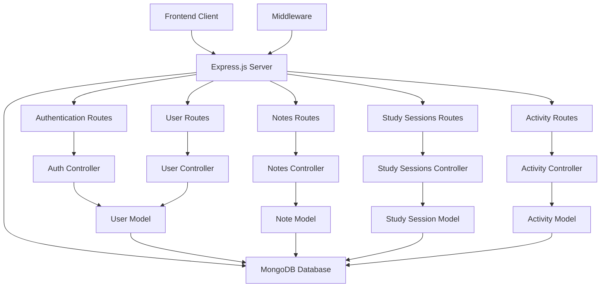

# Zenith Study Backend Architecture

## Components Overview

### 1. Server (server.js)

- Entry point of the application
- Sets up Express.js middleware
- Connects to MongoDB
- Registers API routes

### 2. Configuration (config/)

- Database connection setup

### 3. Middleware (middleware/)

- Authentication middleware for protecting routes

### 4. Models (models/)

- User model for authentication and user management
- Note model for study notes
- StudySession model for collaborative study sessions
- Activity model for tracking user engagement

### 5. Controllers (controllers/)

- Auth controller for registration and login
- User controller for profile management
- Notes controller for note operations
- Sessions controller for study session management
- Activity controller for tracking user activities

### 6. Routes (routes/)

- Authentication routes (/api/auth)
- User routes (/api/users)
- Notes routes (/api/notes)
- Study sessions routes (/api/sessions)
- Activity routes (/api/activities)

### 7. Environment Configuration (.env)

- Environment variables for configuration
